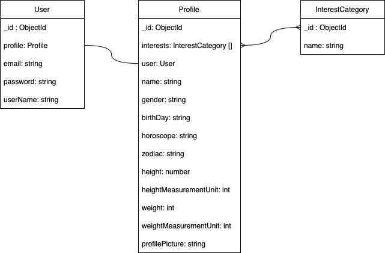
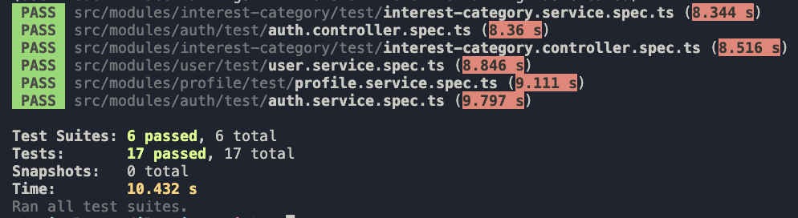
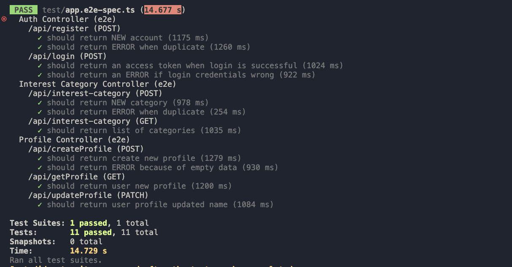

# Simple Profile NestJS
  
# Objective
1.  Create a project using Nest.Js, MongoDB and Node.js implemented using docker with JWT Token, DTO, validations and unit tests.
2. Document the API by adding the params below so that any frontend developers may use it to build the frontend.
a. Register
url : /api/register
b. Login
url : /api/login
c. Create Profile
url : /api/createProfile
d. Get Profile
url : /api/getProfile
e. Update Profile
url : /api/updateProfile

# Analysis
The schema based on user requirement is like the picture bellow
- 

# Prerequisites
## Tools
1. NodeJS
2. Docker
3. Postman
  
# Project Setup
1. Clone this repo.
2. Go to the root project directories
3. Install the packages
    `npm i`
4. clone .env.example file and fill with your credentials

# Testing
## Unit Test
1. Type this command
`npm test`
  This command will run the unit test.
2. Output : 
- 

## Integration Test / E2E Test
1. Type this command
`npm test:e2e`
  This command will run the integration test.
2. Output : 
- 
  
# Docker Build
1. Go to Dockerfile. Fill your ENV credentials 
2. Type this command to build the docker image
  `docker build . -t fgprayogo/nestjs/simple-profile`
3. Start the docker container using the image
  `docker run --name simple-service -p 3000:3000 -d fgprayogo/nestjs/simple-profile`
4. You should able access the service using your localhost network

# REST API Documentation
1. Go do `docs/api/images` directory and download the postman file
2. Import the postman file doc to your postman

## Author
- [@fgprayogo](https://www.github.com/fgprayogo)